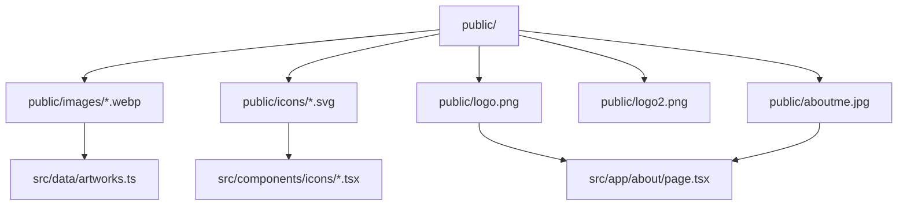

# Static Assets

Static media is served from `public/`, with artwork images in `public/images/`, social icons in `public/icons/`, and route/brand assets such as `aboutme.jpg`, `logo.png`, and `logo2.png`; data references these assets by absolute public paths.

Related
- [../data/artworks-catalog.md](../data/artworks-catalog.md)
- [../ui/portfolio-grid.md](../ui/portfolio-grid.md)
- [../routing/summary.md](../routing/summary.md)



```ts
{
  src: "/images/behind-the-walls.webp",
  title: "Behind The Walls",
  aspectRatio: "portrait"
}
```

Contracts
- Asset paths used by `next/image` must map to files under `public/`.
- Social icon wrappers (`InstagramIcon`, `TwitterIcon`) read SVGs from `public/icons/`.

Invariants
- Artworks are `.webp` files under `public/images/`.
- About route portrait uses `/aboutme.jpg`.
- About route also uses `/logo.png` above biography copy.
- Metadata icons in `src/app/layout.tsx` use `/favicon.ico` for both favicon and apple icon entries.
- `src/app/favicon.ico` exists and is the canonical icon file for browser/favicon metadata.
- Unused default Next starter assets (`next.svg`, `vercel.svg`, etc.) still exist in `public/`.

Rationale
- Local static assets avoid external storage dependencies for the current deployment phase.

Lessons Learned
- Keep data and filename conventions synchronized to prevent broken gallery entries.
