# Lode Map

Index of project knowledge.

Core
- [Summary](summary.md)
- [Terminology](terminology.md)
- [Practices](practices.md)

Plans
- [Current Plan](plans/current-plan.md)

Domains
- Architecture
  - [Architecture Summary](architecture/summary.md)
- Routing
  - [Routing Summary](routing/summary.md)
- UI
  - [UI Summary](ui/summary.md)
  - [Header Navigation](ui/header-navigation.md)
  - [Portfolio Grid](ui/portfolio-grid.md)
  - [Lightbox](ui/lightbox.md)
  - [About Page](ui/about-page.md)
  - [Privacy Policy Page](ui/privacy-policy-page.md)
- Data
  - [Artworks Catalog](data/artworks-catalog.md)
- Components
  - [Masonry Engine](components/masonry-engine.md)
  - [Shared UI Primitives](components/shared-ui-primitives.md)
  - [Social Links Component](components/social-links.md)
- Assets
  - [Static Assets](assets/static-assets.md)
- Ops
  - [Tooling and Build](ops/tooling-and-build.md)
  - [Quality Status](ops/quality-status.md)

Scratch
- `tmp/` (session scraps, git-ignored)

```mermaid
graph TD
  LodeMap["lode-map.md"] --> Summary["summary.md"]
  LodeMap --> Terminology["terminology.md"]
  LodeMap --> Practices["practices.md"]
  LodeMap --> Plans["plans/current-plan.md"]
  LodeMap --> Architecture["architecture/summary.md"]
  LodeMap --> Routing["routing/summary.md"]
  LodeMap --> UI["ui/summary.md"]
  LodeMap --> HeaderNav["ui/header-navigation.md"]
  LodeMap --> PortfolioGrid["ui/portfolio-grid.md"]
  LodeMap --> Lightbox["ui/lightbox.md"]
  LodeMap --> AboutPage["ui/about-page.md"]
  LodeMap --> PrivacyPolicyPage["ui/privacy-policy-page.md"]
  LodeMap --> Data["data/artworks-catalog.md"]
  LodeMap --> Masonry["components/masonry-engine.md"]
  LodeMap --> SharedUI["components/shared-ui-primitives.md"]
  LodeMap --> SocialLinks["components/social-links.md"]
  LodeMap --> Assets["assets/static-assets.md"]
  LodeMap --> Ops["ops/tooling-and-build.md"]
  LodeMap --> Quality["ops/quality-status.md"]
  LodeMap --> Tmp["tmp/"]
```



```bash
ls lode
```

Invariants
- Each Lode file covers one topic, stays under 250 lines, and includes a code example and Mermaid diagram.
- Lode entries link to related Lode files using relative paths.
