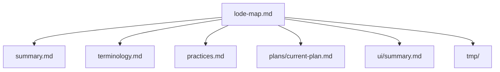

# Lode Map

Index of project knowledge.

Core
- [Summary](summary.md)
- [Terminology](terminology.md)
- [Practices](practices.md)

Plans
- [Current Plan](plans/current-plan.md)

Domains
- [UI Summary](ui/summary.md)

Scratch
- `tmp/` (session scraps, git-ignored)



```bash
ls lode
```

Invariants
- Each Lode file covers one topic, stays under 250 lines, and includes a code example and Mermaid diagram.
- Lode entries link to related Lode files using relative paths.
