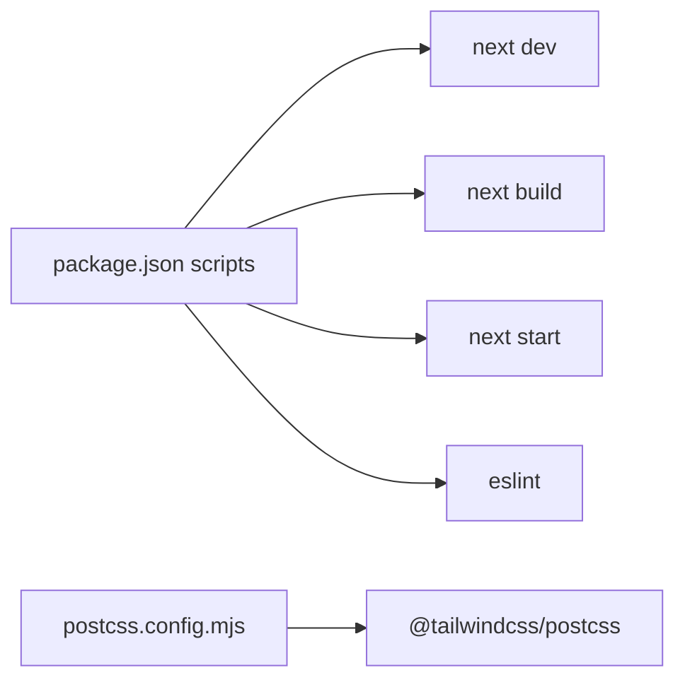

# Tooling and Build

The project is built with Next.js 16 + React 19 + TypeScript 5, uses Tailwind v4 through PostCSS, and runs linting through flat-config ESLint with Next core-web-vitals and TypeScript presets; UI behavior layers include `yet-another-react-lightbox` for fullscreen gallery interactions.

Related
- [../summary.md](../summary.md)
- [../practices.md](../practices.md)
- [../components/shared-ui-primitives.md](../components/shared-ui-primitives.md)
- [quality-status.md](quality-status.md)



```json
{
  "scripts": {
    "dev": "next dev",
    "build": "next build",
    "start": "next start",
    "lint": "eslint"
  }
}
```

Contracts
- `npm run lint` uses `eslint.config.mjs` flat config.
- Tailwind is loaded from `src/app/globals.css` via PostCSS plugin configuration.
- Path alias `@/*` resolves to `src/*` from `tsconfig.json`.

Invariants
- `next`, `eslint-config-next`, and React package versions are aligned to Next 16 and React 19.
- `.next/`, `node_modules/`, and `lode/tmp/` are git-ignored.
- `next.config.ts` is currently default/minimal with no custom options.

Rationale
- Minimal config keeps operational complexity low during content and UX iteration.

Lessons Learned
- Keep generated output out of docs and source review paths; focus memory docs on authored files in `src/` and root config.
