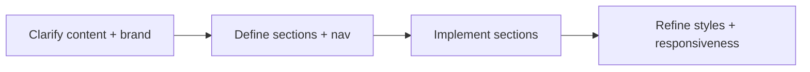

# Current Plan

Short-term plan for shaping the Website Pavic site.

Related
- [Summary](../summary.md)
- [Terminology](../terminology.md)
- [Practices](../practices.md)



```tsx
export default function Home() {
  return (
    <main>
      <section id="hero" />
      <section id="services" />
      <section id="about" />
      <section id="contact" />
    </main>
  );
}
```

Plan
1. Clarify target content and visual direction for the homepage.
2. Define navigation structure and route map.
3. Replace placeholder header and footer content.
4. Build homepage sections (hero, services, about, contact).
5. Align global styles with brand (colors, typography, spacing).
6. Verify responsive layout and accessibility basics.

Invariants
- The root layout continues to wrap all pages.
- Home page remains the main entry point.
