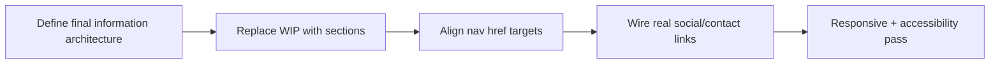

# Current Plan

Short-term implementation plan for the current `BV Dizajn` shell.

Related
- [Summary](../summary.md)
- [Terminology](../terminology.md)
- [Practices](../practices.md)
- [UI Summary](../ui/summary.md)
- [Root Plan](../../plan.md)



```tsx
export default function Home() {
  return (
    <main>
      <section id="about" />
      <section id="portfolio" />
      <section id="contact" />
    </main>
  );
}
```

Plan
1. Replace `WIP` in `src/app/page.tsx` with real homepage sections.
2. Align section IDs with current header links (`about`, `portfolio`, `contact`) and remove the `porfoleo` typo.
3. Replace `#` placeholders in footer social links with real destinations.
4. Add content spacing offsets so fixed header does not cover in-page anchors.
5. Run lint/build checks once content sections are added.

Invariants
- Home page remains the primary route entry point.
- Navigation stays available on desktop and mobile breakpoints.
- `plan.md` at repository root captures the execution checklist for current delivery phase.
