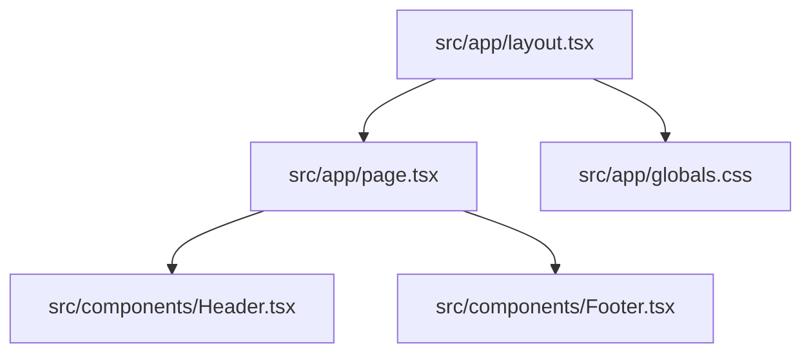

# Practices

Patterns and conventions currently used in this repository.

Related
- [Summary](summary.md)
- [Terminology](terminology.md)
- [Current Plan](plans/current-plan.md)
- [UI Summary](ui/summary.md)



```tsx
const [mobileOpen, setMobileOpen] = useState(false);

<button onClick={() => setMobileOpen(!mobileOpen)}>
  {mobileOpen ? <X className="h-6 w-6" /> : <Menu className="h-6 w-6" />}
</button>;
```

Practices
- Keep route-level assembly in `src/app/page.tsx` and keep reusable chrome in `src/components/`.
- Use Tailwind utility classes as default styling mechanism and reserve global tokens for `src/app/globals.css`.
- Enable animation utilities in `src/app/globals.css` via `@plugin 'tailwindcss-animate';` for Turbopack-compatible Tailwind animation classes.
- Keep header behavior client-side only (`"use client"`) when using local interaction state.
- Use semantic containers (`header`, `main`, `footer`) even while page content is still in placeholder mode.
- Keep iconography sourced from `lucide-react` to maintain consistent stroke style.

Invariants
- `src/app/layout.tsx` always imports `src/app/globals.css`.
- `src/app/globals.css` defines Tailwind animation support with `@plugin 'tailwindcss-animate';`.
- `Header` is fixed (`fixed top-0 left-0 right-0 z-50`) and therefore independent from page scroll.
- Mobile menu visibility is controlled by classes derived from a single boolean (`mobileOpen`).
