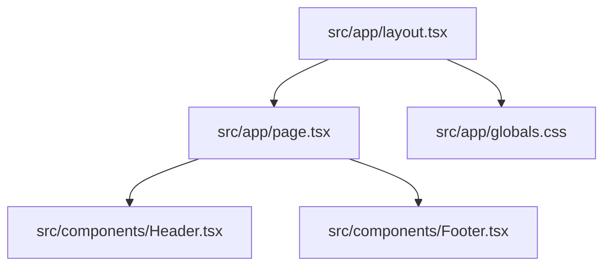

# Summary

`website-petra` is currently a Next.js 16 App Router single-page shell where `src/app/layout.tsx` provides global metadata, font variables, and base styles while `src/app/page.tsx` composes a fixed `Header`, a placeholder `WIP` main area, and a `Footer`; the page uses a `min-h-screen flex-col` wrapper with `main` set to `flex-1`, so the footer stays pinned to the bottom when content is short.

Related
- [Terminology](terminology.md)
- [Practices](practices.md)
- [Current Plan](plans/current-plan.md)
- [UI Summary](ui/summary.md)



```tsx
export default function Home() {
  return (
    <div className="flex min-h-screen flex-col bg-zinc-50 font-sans dark:bg-black">
      <Header />
      <main className="flex flex-1 items-center justify-center pt-20">WIP</main>
      <Footer />
    </div>
  );
}
```

Invariants
- App routing uses App Router files under `src/app/`.
- Root metadata title is `Black Vomit`; favicon and apple-touch metadata icons both point to `/favicon.ico`.
- Page composition currently happens in `src/app/page.tsx` (not in root layout).
- Header is fixed to the top and controls mobile navigation open/close state locally.
- Footer renders social icon links and a 2026 copyright line.
- Footer placement is enforced by page-level vertical flex layout (`flex-col` + `main.flex-1`).
