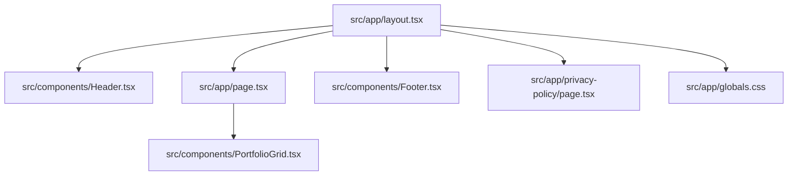

# Summary

`website-petra` is a Next.js 16 App Router portfolio site where `src/app/layout.tsx` provides global metadata, font variables, shared chrome (`Header`, `Footer`, `Toaster`), and global styles (including `yet-another-react-lightbox` CSS), while `src/app/page.tsx` renders the masonry-based `PortfolioGrid`, `/propaganda` provides artist context content, and `/privacy-policy` serves legal/privacy copy linked from the global footer.

Related
- [Terminology](terminology.md)
- [Practices](practices.md)
- [Current Plan](plans/current-plan.md)
- [UI Summary](ui/summary.md)



```tsx
export default function Home() {
  return <PortfolioGrid />;
}
```

Invariants
- App routing uses App Router files under `src/app/`.
- Root metadata title is `Black Vomit`; favicon and apple-touch metadata icons both point to `/favicon.ico`.
- Shared chrome composition happens in `src/app/layout.tsx`, while route files render route-specific content.
- Header is fixed to the top and controls mobile navigation open/close state locally.
- Home route is the artwork portfolio grid with a full-screen lightbox experience.
- `src/app/propaganda/page.tsx` provides static artist biography + imagery content.
- Footer renders social icon links, a privacy-policy route link, and a 2026 copyright line on every route.
