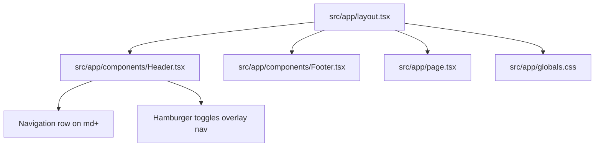

# Summary

Website Pavic is a small Next.js 16 App Router site under `src/app` with a shared root layout (header + footer), a minimal home page, and Tailwind CSS v4 global styles; reusable sections live in `src/components`, the header contains responsive navigation with a desktop inline menu and a mobile full-width overlay menu, and the About section renders a portrait photo from `public/ivan-pavic-photo.jpg`.

Related
- [Terminology](terminology.md)
- [Practices](practices.md)
- [Current Plan](plans/current-plan.md)
- [Internationalization](i18n/summary.md)



```tsx
export default async function RootLayout({
  children,
  params
}: {
  children: React.ReactNode;
  params: Promise<{locale: string}>;
}) {
  const {locale} = await params;

  return (
    <html lang={locale}>
      <body>
        <NextIntlClientProvider>
          <Header />
          {children}
          <Footer />
        </NextIntlClientProvider>
      </body>
    </html>
  );
}
```

Invariants
- All pages render inside the shared root layout.
- Styling uses Tailwind utility classes plus `src/app/globals.css`.
- The home page lives at `src/app/page.tsx`.
- Mobile navigation links render only after tapping the hamburger icon in `src/app/components/Header.tsx`.
- Open mobile navigation is a full-width overlay dropdown and does not push page content down.
- Hero carousel rotates three assets from `public/`: `sv-duje.png`, `lady-justice.jpg`, and `document-signing.jpg`; users can change slides with dot clicks and image left/right click zones, and dot clicks are isolated so they do not bubble into the zone-click navigation.
- Hero pills (badge chips under the headline) are scaled up about 5% via custom `px/py/text` sizing.
- Home content sections (`About`, `Services`, `Contact`) use unified vertical spacing `py-10 lg:py-12` to match the Hero section rhythm.
- On large screens, the About section aligns text and portrait vertically with `lg:items-center` so copy sits centered relative to the photo.
- The About right-column content is uniformly scaled to `1.05` with `origin-top`, making all text-side UI elements about 5% larger.
- The About image in `src/components/About.tsx` is rendered with `next/image` from `/ivan-pavic-photo.jpg`, uses a clean `max-w-md` 3:4 frame (`sizes` desktop target `28rem`) with rounded corners and shadow only (no border or ring), and has no inner inset border overlay.

Rationale
- A simple layout keeps the site structure consistent while content evolves.
