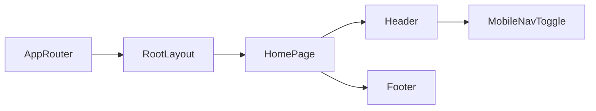

# Terminology

Common project terms and current meanings.

Terms
- App Router - Next.js file-based routing rooted in `src/app/`.
- Root Layout - Global wrapper in `src/app/layout.tsx` that sets fonts, metadata, and global CSS import.
- Home Page - `src/app/page.tsx`, currently the only route UI with `Header`, `main`, and `Footer`.
- Theme Tokens - CSS variables in `src/app/globals.css` exposed through Tailwind v4 `@theme inline`.
- Mobile Nav Toggle - `mobileOpen` state in `src/components/Header.tsx` controlling collapsed/expanded mobile links.
- Brand Surface - The dark header background class `bg-brand-900` used as the top bar visual anchor.

Related
- [Summary](summary.md)
- [Practices](practices.md)
- [Current Plan](plans/current-plan.md)
- [UI Summary](ui/summary.md)



```ts
export function cn(...inputs: ClassValue[]) {
  return twMerge(clsx(inputs));
}
```

Contracts
- `src/components/` is the reusable UI boundary for route files.
- `src/app/globals.css` remains the single source for global token definitions.
