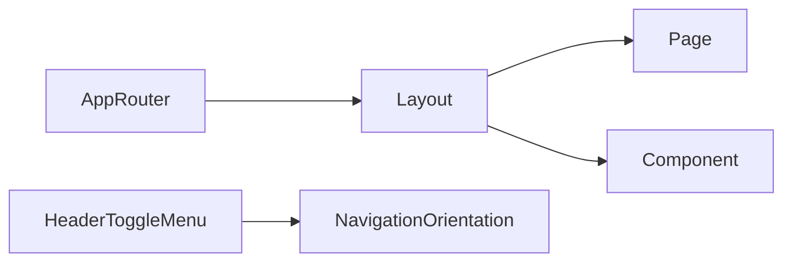

# Terminology

Common project terms and their meaning.

Terms
- App Router - Next.js routing model where pages live in `src/app/`.
- Root Layout - The shared shell in `src/app/layout.tsx` that wraps all pages.
- Page - A route entry such as `src/app/page.tsx`.
- Global Styles - Tailwind base layer and custom CSS in `src/app/globals.css`.
- Component - Reusable UI module under `src/components/`.
- Header Toggle Menu - Mobile-only hamburger trigger in `src/components/Header.tsx` that toggles a full-width overlay menu.
- Navigation Orientation - `orijentation` prop in `Navigation` selecting `row` (desktop) or `col` (mobile overlay) layout.

Related
- [Summary](summary.md)
- [Practices](practices.md)
- [Current Plan](plans/current-plan.md)
- [Internationalization](i18n/summary.md)



```ts
export const routing = {
  locales: ["hr", "en"],
  defaultLocale: "hr",
  localePrefix: "as-needed"
};
```

Contracts
- Components under `src/components/` are intended for reuse across pages.
- Layout owns global page chrome (header/footer).
