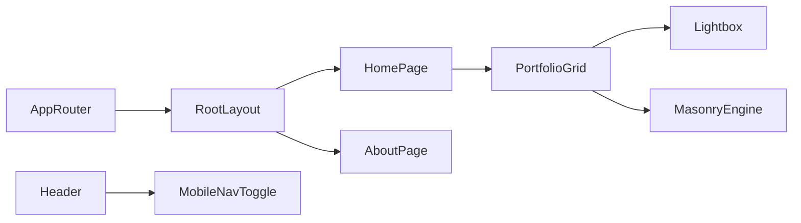

# Terminology

Common project terms and current meanings.

Terms
- App Router - Next.js file-based routing rooted in `src/app/`.
- Root Layout - Global wrapper in `src/app/layout.tsx` that sets metadata, fonts, dark theme shell, and persistent chrome.
- Portfolio Grid - Client component in `src/components/PortfolioGrid.tsx` rendering artwork cards in masonry columns.
- Lightbox - Full-screen modal in `PortfolioGrid` that previews selected artwork and metadata.
- Yet Another React Lightbox - External gallery/lightbox package used by `PortfolioGrid` for swipe, keyboard, and backdrop-controlled fullscreen artwork browsing.
- Masonry Engine - Custom virtualized masonry implementation in `src/components/custom/masonry.tsx`.
- Social Links - Shared icon-link set in `src/components/SocialLinks.tsx` used in both header and footer.
- Theme Tokens - CSS variables in `src/app/globals.css` exposed through Tailwind v4 `@theme inline`.
- Mobile Nav Toggle - `mobileOpen` state in `src/components/Header.tsx` controlling the fixed mobile menu.

Related
- [Summary](summary.md)
- [Practices](practices.md)
- [Current Plan](plans/current-plan.md)
- [UI Summary](ui/summary.md)
- [Routing Summary](routing/summary.md)
- [Masonry Engine](components/masonry-engine.md)



```ts
export function cn(...inputs: ClassValue[]) {
  return twMerge(clsx(inputs));
}
```

Contracts
- `src/components/` is the reusable UI boundary for route files.
- `src/app/globals.css` is the global source for semantic color and radius tokens.
- Artwork metadata shape is defined in `src/types/artworks.ts` and consumed by `src/data/artworks.ts`.
