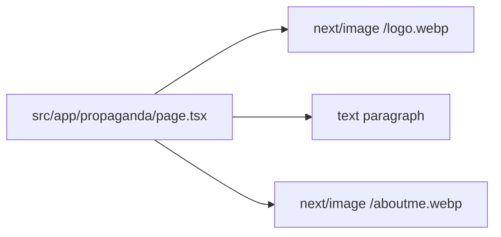

# About Page

The `/propaganda` route renders a two-column section with brand logo + artist biography text on the left and a portrait image on the right, using responsive grid behavior that stacks on small screens and aligns content side-by-side on large screens.

Related
- [summary.md](summary.md)
- [../routing/summary.md](../routing/summary.md)
- [../assets/static-assets.md](../assets/static-assets.md)



```tsx
<div id="about" className="scroll-mt-20 bg-background py-10 lg:py-12">
  <div className="grid gap-14 lg:grid-cols-2 lg:items-start">
    <Image src="/logo.webp" alt="Black Vomit logo" width={624} height={624} />
    <p>Black Vomit is a Croatian artist...</p>
    <Image src="/aboutme.webp" alt="artist" fill priority />
  </div>
</div>
```

Contracts
- Route path is `/propaganda` from `src/app/propaganda/page.tsx`.
- Brand logo is rendered centered above biography copy from `/logo.webp`.
- About portrait uses `next/image` with `fill` and a constrained aspect-ratio wrapper.

Invariants
- Outer section uses `id="about"` and `scroll-mt-20`.
- Content container max width is `max-w-350` with responsive horizontal padding.
- On large screens, left and right columns align to the top (`lg:items-start`).
- Logo is displayed centered above the bio copy at a large visual size (`w-[31.2rem]`).
- Logo, bio copy, and portrait are all always rendered (no conditional logic).

Rationale
- Dedicated route allows richer biography content without overloading the gallery page.

Lessons Learned
- Keep biography copy and image in the same route component while content is still static.
