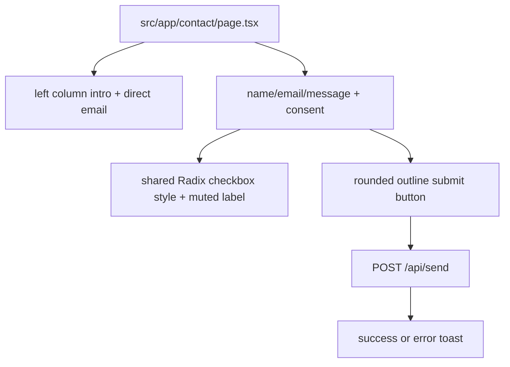

# Contact Page

The `/contact` route renders a two-column contact layout with intro copy, direct email link, validated form inputs, a consent checkbox styled the same as the footer newsletter checkbox, and a submit button that matches the footer newsletter button style and hover animation.

Related
- [summary.md](summary.md)
- [newsletter-form.md](newsletter-form.md)
- [../routing/summary.md](../routing/summary.md)



```tsx
<label htmlFor="consent" className="flex items-center gap-2 text-xs text-muted-foreground">
  <Checkbox id="consent" className="h-4 w-4 rounded border-border/70" />
  <span className="font-normal">I consent to the processing...</span>
</label>
```

Contracts
- Form submit sends JSON payload (`name`, `email`, `message`) to `/api/send`.
- Consent checkbox must be checked before submission; otherwise submit shows a toast error and does not call the API.
- Submit button is disabled while a request is in flight.

Invariants
- Contact intro title is `Get in touch` with no separate eyebrow label above it.
- Contact title has no top margin offset (`mt-0`) so left-column content aligns cleanly after eyebrow removal.
- Contact title uses a reduced heading scale (`text-2xl`, `lg:text-3xl`).
- Contact intro body copy reads: `For inquiries or collaborations, please use the contact form. Feel free to reach out and I'll get back to you as soon as possible.`
- Left intro column is vertically centered within its grid cell (`justify-center`).
- Submit control uses the same rounded outline visual language and color-transition hover as `NewsletterForm`.
- Contact submit CTA is text-only (no icon glyph).
- Consent checkbox and consent label typography match the footer newsletter treatment (`Checkbox` + muted `text-xs` non-bold copy).
- Contact section renders without a top horizontal divider line.
- Contact content container removes extra top and bottom padding (`pt-0`, `pb-0`) so the section ends directly above the footer.
- Direct email link keeps a zero-gap text/icon pair (`gap-0`) so arrow hover motion stays visually close to the email text.
- Success and failure outcomes are communicated via toast notifications.

Rationale
- Matching newsletter CTA styling keeps call-to-action treatment consistent across footer and contact route.

Lessons Learned
- Removing decorative icons from form CTAs can improve clarity when the action label is already explicit.
