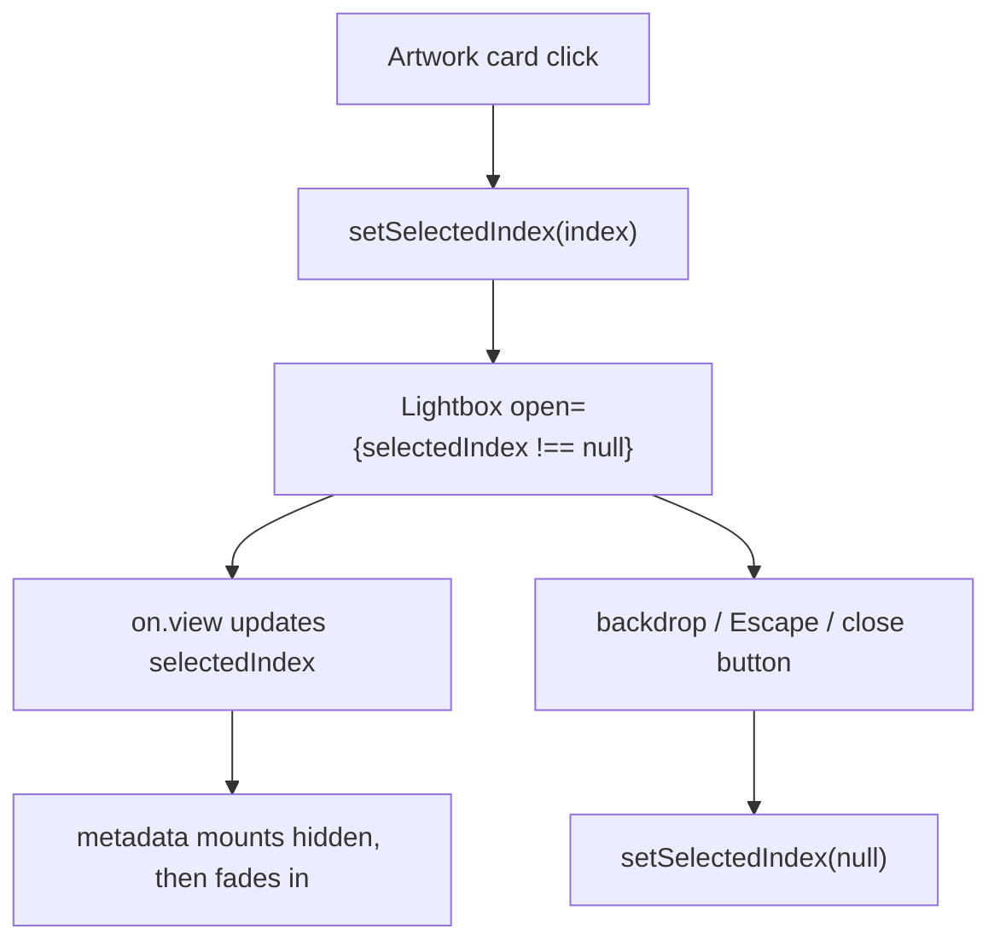

# Lightbox

The lightbox is powered by `yet-another-react-lightbox` inside `PortfolioGrid`; it opens from a selected artwork index, supports native swipe + keyboard navigation, loops through slides, and uses a custom slide renderer so title/medium/year metadata appears beside the image (matching the pre-library layout).

Related
- [portfolio-grid.md](portfolio-grid.md)
- [../data/artworks-catalog.md](../data/artworks-catalog.md)
- [../practices.md](../practices.md)



```tsx
<Lightbox
  open={selectedIndex !== null}
  index={selectedIndex ?? 0}
  close={() => setSelectedIndex(null)}
  slides={slides}
  carousel={{ finite: false }}
  render={{ slide: ({ slide }) => <CustomSlide slide={slide} /> }}
  on={{ view: ({ index }) => setSelectedIndex(index) }}
/>
```

Contracts
- Modal mount condition is `selectedIndex !== null`.
- `selectedIndex` is the single source of truth for the active slide.
- Lightbox navigation updates local state through `on.view`, keeping card index and modal index synchronized.
- Custom slide rendering keeps metadata in a separate side block instead of top/bottom caption slots.
- Each slide reserves a fixed metadata rail width on `md+` (`md:w-52`), even when metadata is hidden, to prevent horizontal recenter jolts during navigation.
- Metadata uses the original flow layout (below image on mobile, right rail on desktop), and non-active slides render invisible metadata placeholders to keep slide height stable during swipe.
- Close interactions (backdrop, Escape, close button) always clear selection with `setSelectedIndex(null)`.
- While open, Tab/Shift+Tab are trapped and manually cycled in a fixed order: close (`X`) -> previous arrow -> next arrow -> close.
- Lightbox open does not auto-focus controls; the first Tab press while open moves focus to close (`X`).
- Previous/next toolbar buttons remain in keyboard order so the custom cycle can advance through both arrows.
- Lightbox control buttons show the custom rounded-square selection border only for keyboard focus (`:focus-visible`), not for mouse click focus.
- Keyboard focus styling preserves original icon/button color and opacity; only the border/outline treatment changes.
- Focus border is rendered with outline + inset ring (not layout border), and `:focus-visible` explicitly keeps baseline button color/filter so keyboard focus does not brighten icons while mouse hover still brightens them.
- Lightbox button slot applies compact control padding (`styles.button.padding = 4px`) so the focus square hugs close/arrow icons more tightly.
- Metadata for the active slide mounts at `opacity: 0` and fades in once after slide motion plus a reduced buffer (`animation.swipe = 650ms` + `100ms`), using a `1400ms` opacity transition.

Invariants
- Overlay uses a near-black backdrop (`rgba(0, 0, 0, 0.9)`) with subtle blur (`backdrop-filter: blur(4px)`), matching the pre-library visual weight.
- Swipe gestures are enabled on touch devices by the lightbox library without custom touch handlers.
- Previous/next navigation loops continuously (`carousel.finite = false`).
- Metadata block is centered below the image on mobile and fixed to the right side on `md+` screens.
- Non-active slides keep reserved metadata height via invisible placeholders, reducing vertical layout shifts before horizontal swipe.
- `on.view` only commits state when the index actually changes, reducing avoidable render churn during slide transitions.

Rationale
- Library-managed gestures and keyboard behavior reduce custom modal maintenance.
- Co-locating `selectedIndex` state with the grid keeps open/close behavior explicit and predictable.

Lessons Learned
- Prefer purpose-built interaction libraries when behavior parity across desktop and mobile matters.
