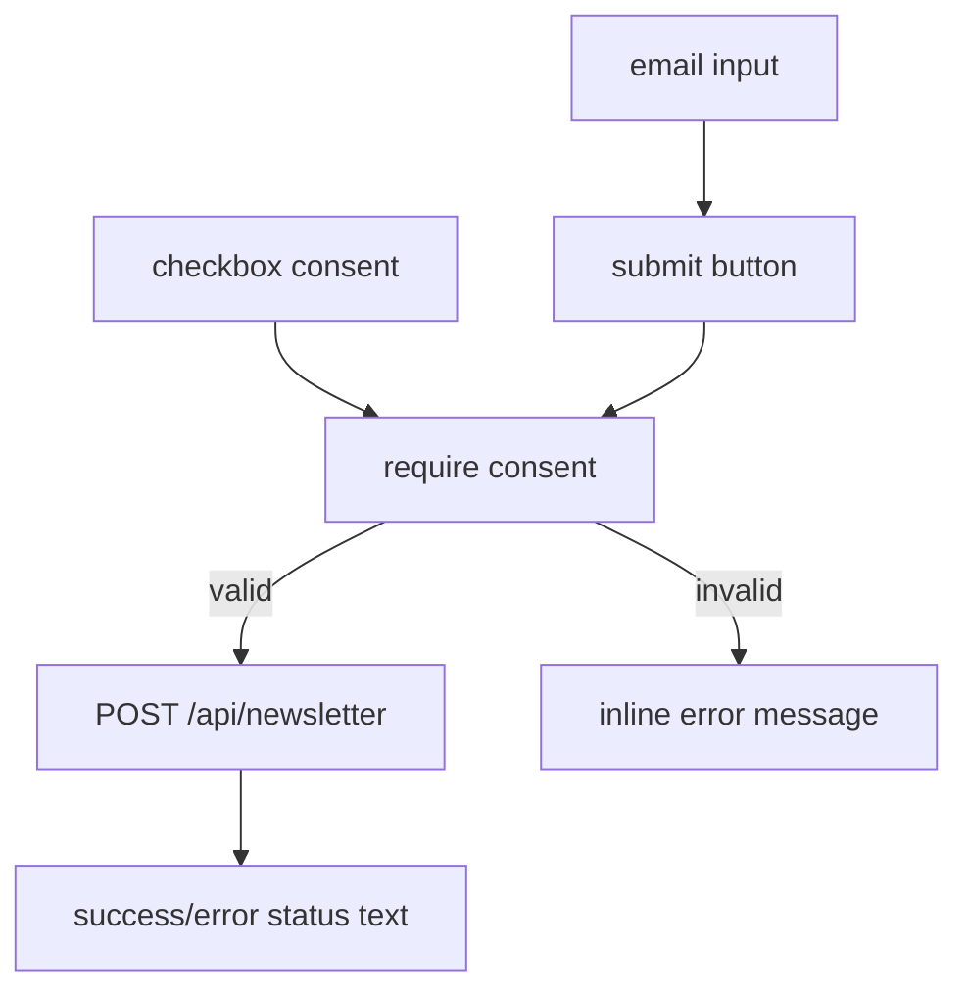

# Newsletter Form

`NewsletterForm` is the subscription UI used on the contact route, handling email submission to `/api/newsletter`, consent gating, inline status messaging, and compact checkbox/text alignment.

Related
- [summary.md](summary.md)
- [../routing/summary.md](../routing/summary.md)
- [../practices.md](../practices.md)



```tsx
<label
  htmlFor="newsletter-consent"
  className="flex w-full items-center justify-center gap-2 text-xs text-muted-foreground"
>
  <Checkbox id="newsletter-consent" className="h-4 w-4" />
  <span>I agree to receive newsletter emails.</span>
</label>
```

Contracts
- Form submission normalizes email to lowercase trimmed value before posting.
- Consent must be checked; otherwise submit returns a validation error message.
- Status text is rendered inline and reflects `loading`, `success`, or `error` outcomes.
- Success status text auto-dismisses after 10 seconds and resets to idle state.

Invariants
- Consent row aligns checkbox and label text on a shared center baseline (`items-center`).
- Newsletter heading is centered (`text-center`).
- Newsletter heading uses an enlarged label size (`text-sm`) with uppercase tracking.
- Newsletter heading applies a small optical nudge to the right (`translate-x-[3px]`) so it visually aligns with the centered social icon row.
- Consent row is centered as a group (`justify-center`) while keeping baseline alignment (`items-center`).
- Consent checkbox keeps compact sizing (`h-4 w-4`) and one-line label copy.
- Submit CTA and input share consistent 44px-height controls (`h-11`).

Rationale
- Inline consent with tight alignment improves readability and trust in a minimal footer/contact layout.

Lessons Learned
- Minor vertical misalignment in checkbox rows is visually noticeable in dense typography and should be corrected with explicit flex alignment.
