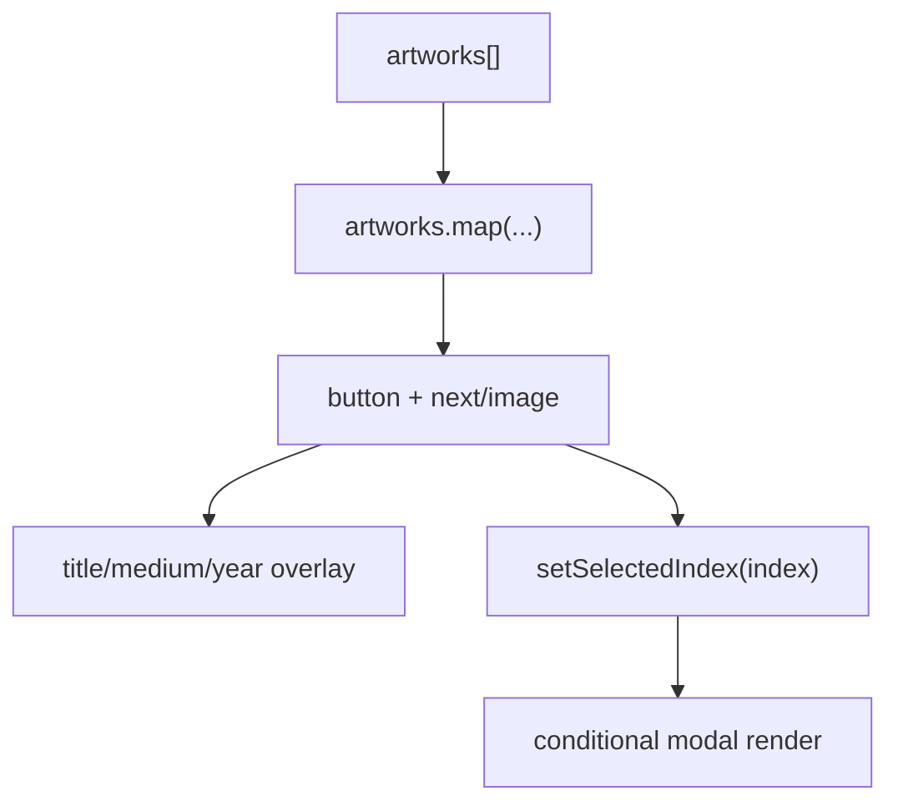

# Portfolio Grid

`PortfolioGrid` is the homepage feature component that maps typed artwork data into interactive masonry cards with image overlays, responsive columns, and click-to-open detail preview with index-based lightbox navigation.

Related
- [summary.md](summary.md)
- [lightbox.md](lightbox.md)
- [../data/artworks-catalog.md](../data/artworks-catalog.md)
- [../components/masonry-engine.md](../components/masonry-engine.md)



```tsx
const aspectRatio = artwork.aspectRatioValue ?? aspectRatioFallback;

<button style={{ aspectRatio }} onClick={() => setSelectedIndex(index)}>
  <Image src={artwork.src} alt={artwork.alt} fill className="object-cover" />
</button>
```

Contracts
- Each card is a keyboard-focusable button with `aria-label`.
- Aspect ratio is always set per card using explicit value or category fallback.
- Masonry children are wrapped in `MasonryItem asChild` for positioning.
- Lightbox selection is index-based so previous/next navigation can wrap across the whole dataset.

Invariants
- Grid uses `columnWidth={420}` and `maxColumnCount={3}` with 24px column/row gaps.
- Home grid top spacing follows page-section rhythm (`py-10 lg:py-12`) with no extra inner top offset (`pt-0`), matching About/Contact header-to-content spacing.
- Overlay metadata reveals with a slow (`~1100ms`) opacity fade on hover at `sm` and above, always visible on smaller screens.
- Hover state does not apply translate/scale transforms to cards or images.
- Artwork cards use square corners (no border-radius) with `overflow-hidden` so image edges match the card frame.
- Artwork cards render without a visible border stroke.
- Card interactions are local client state only and do not mutate data source.
- Opening a card sets a stable index that drives keyboard (`ArrowLeft`/`ArrowRight`), desktop side-arrow clicks, and mobile swipe navigation in the lightbox, with one shared full-width left/right slide transition plus synchronized metadata fade.

Rationale
- A static array + client rendering provides fast startup and deterministic ordering.
- Ratio hints reduce visual jank compared with purely measured first-pass layout.

Lessons Learned
- Include meaningful `alt` and metadata fields in the dataset to keep gallery cards and modal details aligned.
