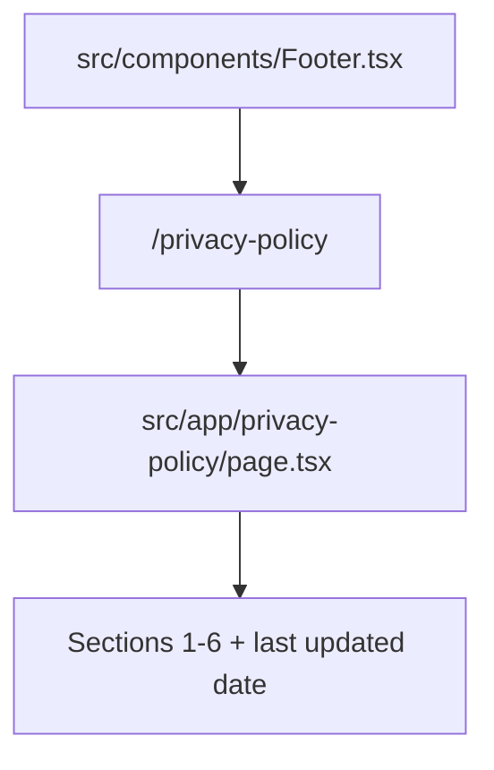

# Privacy Policy Page

The `/privacy-policy` route renders static legal/privacy copy in a readable single-column article layout, and the global footer links to this route so policy access is available from every page.

Related
- [summary.md](summary.md)
- [../routing/summary.md](../routing/summary.md)
- [../summary.md](../summary.md)



```tsx
<Link href="/privacy-policy" className="text-xs tracking-wide text-muted-foreground">
  Privacy Policy
</Link>
```

Contracts
- Route path is `/privacy-policy` from `src/app/privacy-policy/page.tsx`.
- Page content is static JSX matching the current policy copy and section numbering.
- Footer link always uses internal Next.js routing via `next/link`.

Invariants
- Policy page keeps a centered narrow reading width (`max-w-3xl`) with stacked sections.
- Footer privacy link is anchored to the right in the bottom row and vertically aligned with the centered copyright text.
- Heading hierarchy is fixed: `h1` page title with section-level `h2` headings.
- Contact email in policy copy is `bv.dizajn@hotmail.com`.
- Last updated date is rendered as `March 10, 2026`.

Rationale
- A dedicated legal route avoids cluttering portfolio/bio pages while maintaining clear compliance access.

Lessons Learned
- Footer-owned legal links provide stable discoverability across all current and future routes.
