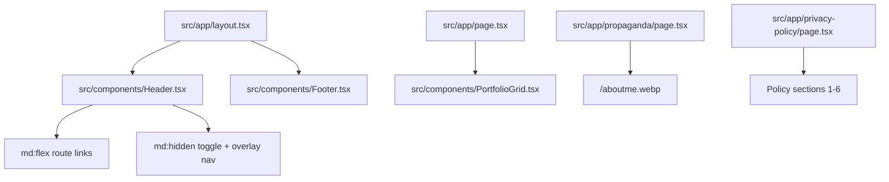

# UI Summary

The UI is a dark-themed portfolio experience with persistent header/footer chrome, a masonry artwork grid on `/`, an artist biography section on `/propaganda`, and a legal copy page on `/privacy-policy`; navigation is route-based (not in-page anchors), social/contact entry points are icon-only links reused across header and footer, and artwork preview uses `yet-another-react-lightbox` for swipe-friendly fullscreen browsing.

Related
- [../summary.md](../summary.md)
- [../terminology.md](../terminology.md)
- [../practices.md](../practices.md)
- [header-navigation.md](header-navigation.md)
- [portfolio-grid.md](portfolio-grid.md)
- [lightbox.md](lightbox.md)
- [about-page.md](about-page.md)
- [privacy-policy-page.md](privacy-policy-page.md)



```tsx
<button
  className="group relative w-full overflow-hidden rounded-2xl border border-border/70 bg-card"
  onClick={() => setSelectedArtwork(artwork)}
>
  <Image src={artwork.src} alt={artwork.alt} fill className="object-cover" />
</button>
```

Invariants
- Header and footer render on all routes because they are mounted in root layout.
- Desktop nav links are visible from `md` and up; mobile nav is a toggleable fixed panel.
- Home route always renders artwork cards via `artworks.map(...)`.
- Artwork click opens `yet-another-react-lightbox` with looped previous/next navigation and touch swipe support.
- Footer always renders social icons, a privacy policy route link, and ownership text.
