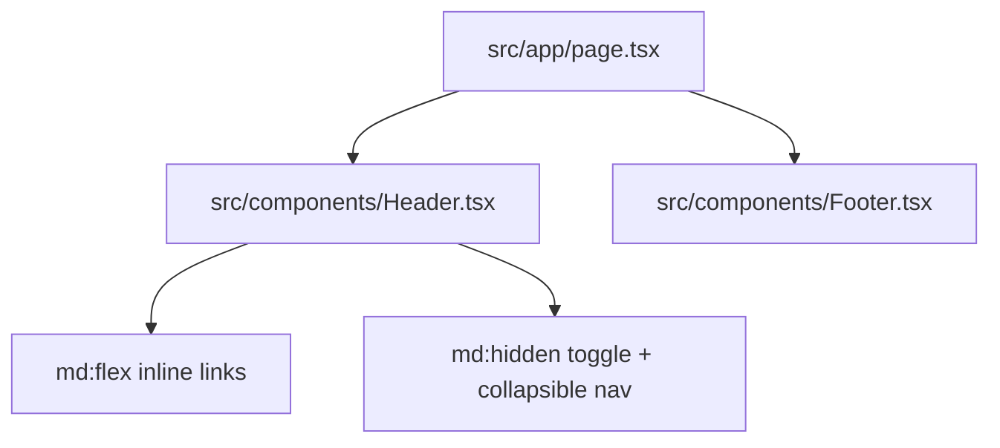

# UI Summary

The UI layer currently consists of a fixed top header with responsive navigation controls, a minimal home content placeholder (`WIP`), and a footer with icon-only social links; `src/app/page.tsx` uses a column flex shell with `main.flex-1` so the footer rests at the bottom of the viewport when content is sparse.

Related
- [../summary.md](../summary.md)
- [../terminology.md](../terminology.md)
- [../practices.md](../practices.md)



```tsx
<div
  className={`origin-top overflow-hidden transition-[max-height,opacity,transform] duration-300 ease-in-out md:hidden ${
    mobileOpen
      ? "pointer-events-auto max-h-80 scale-y-100 opacity-100"
      : "pointer-events-none max-h-0 scale-y-95 opacity-0"
  }`}
/>
```

Invariants
- Desktop nav links are visible from `md` and up.
- Mobile nav links are hidden until the toggle is opened.
- Header remains fixed above page content (`z-50`).
- Footer always renders social icons and ownership text.
- Page shell uses `min-h-screen flex-col` and `main.flex-1` to anchor footer placement.
